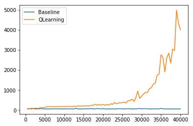
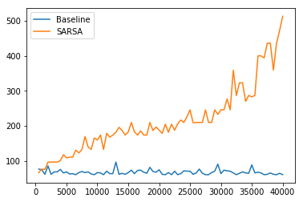

# Flappy-Bird-using-RL
The code in this repository is used to train agents to play FlappyBird using techniques from reinforcement learning. Q-Learning and SARSA are implemented.
You can find the video presentation for this project here - https://youtu.be/1FOySGmQQ4c

## Names:
Roja Immanni

## Research Question:
We applied different Reinforcement Learning algorithms train an agent to play FlappyBird game forever?

## Reinforcement Learning Framework
For this game, We can frame the RL problem in the following way
- Environment: Flappybird's game space
- Agent: Agent is the flappybird who decides either to do nothing or jump
- States: Flappybird's vertical distance from the ground, horizontal distance from the next pipe and its speed
- Actions: Actions would be either to do nothing or jump
- Rewards: positive reward(+1) if the bird is still alive and negative reward(-1000) if it hits and dies

## Methods:
We have tried the on-policy(SARSA) and off-policy technique(Q-Learning) with the epsilon-greedy approach and compared it with the baseline model 
Baseline: For the baseline model, we picked an agent that picks the next action randomly. The actions space contains (0, 1) where 0 stands for jump, and 1 stands for doing nothing. Random agent picks each of these actions with probability 0.5.

## Code files
Code for environment can be found at https://github.com/RojaImmanni/FlappyBird_using_RL/blob/master/Game/environment.py

Code for random agent can be found at https://github.com/RojaImmanni/FlappyBird_using_RL/blob/master/Agents/Baseline_agent.py

Code for a Q-Learning agent can be found at https://github.com/RojaImmanni/FlappyBird_using_RL/blob/master/Agents/Q_agent.py

Code for a SARSA agent can be found at https://github.com/RojaImmanni/FlappyBird_using_RL/blob/master/Agents/SARSA_agent.py

## Model results
The figure below shows the maximum score by different models when trained for 40,000 iterations. Clearly we have better results with both the models compared to the baseline model i.e the random agent. There is a huge performance difference between SARSA and Q-learning. Q-learning algorithm has achieved higher scores in a lesser number of iterations. Q-Learning performed better over SARSA which would be because Q-learning is an off-policy that uses the optimal policy directly estimating the optimal policy quicker than SARSA which is on-policy learning and it has to go through all the combinations of the actions at every state to find the best policy.

Figure 1 compares the results of SARSA model with baseline

Figure 2 compares the results of Q-Learning model with baseline

## Final Model:
The final model chosen for this problem is Q-Learning due to its better performance over SARSA

## Resources:
1. https://arxiv.org/pdf/2003.09579v1.pdf
